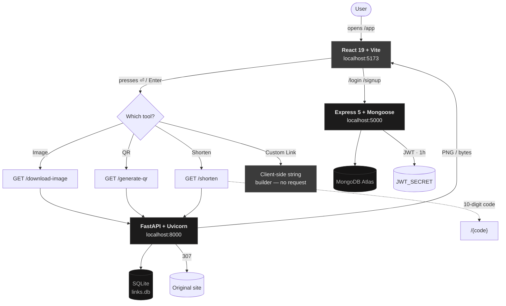

<div align="center">

# LinkCode

### A link toolbox with taste

**Four link utilities — download, customise, QR, shorten — under one monochrome shell,
with a React front end, a FastAPI tools API and an Express auth API.**

[](https://react.dev)
[](https://www.typescriptlang.org)
[](https://vite.dev)
[](https://fastapi.tiangolo.com)
[](https://expressjs.com)
[](https://nodejs.org)
[](https://www.python.org)
[](#license)
[](https://github.com/Lavish09-Mehra)
[](https://www.linkedin.com/in/lavish09dev/)
[](mailto:developer09lavish@gmail.com)

<br/>

`git clone` → three terminals → you're running.

</div>

---

## Table of contents

- [What it is](#what-it-is)
- [The four tools](#the-four-tools)
- [Architecture](#architecture)
- [Project structure](#project-structure)
- [Getting started](#getting-started)
- [Environment variables](#environment-variables)
- [Frontend routes](#frontend-routes)
- [API reference](#api-reference)
- [Design system](#design-system)
- [Data model](#data-model)
- [Key implementation decisions](#key-implementation-decisions)
- [Verification](#verification)
- [Known issues](#known-issues)
- [Troubleshooting](#troubleshooting)
- [Roadmap](#roadmap)
- [Author](#author)
- [License](#license)

---

## What it is

LinkCode is a single-page toolbox for the four things you do to a link all day: pull the
image out of it, wrap it in your own words, turn it into a QR code, and squash it.

It is deliberately **not** a dashboard. Pick a tool, paste a link, press <kbd>⏎</kbd>.
The panel that appears below is the whole interface.

Three processes make it work:

| Process | Stack | Port | Job |
|---|---|---|---|
| **Frontend** | React 19 + Vite + TypeScript | `5173` | The UI. Four tool panels, one shell. |
| **Tools API** | FastAPI + Uvicorn | `8000` | Image proxy, QR rendering, short links. |
| **Auth API** | Express 5 + Mongoose | `5000` | Signup and login against MongoDB Atlas. |

> **Scope note:** the tools API is Python, as specified. Only the auth API is Node —
> it is the original MERN layer and carries the Mongo models.

### Highlights

- **One press, one request.** Output is gated behind <kbd>⏎</kbd> / <kbd>Enter</kbd>, so
  typing never fires a network call. Previously every keystroke hit the backend.
- **No dead links.** Short URLs are built from the host the request arrived on, stored in
  SQLite, and resolve with a `307` so visits keep counting.
- **Monochrome, on purpose.** One ink, one hairline, one radius, one easing curve across
  every page.
- **Motion that explains, not decorates.** One orchestrated entrance per tool plus an
  action-response. No scroll-triggered reveals, and every animation is disabled under
  `prefers-reduced-motion`.
- **Zero new dependencies** for the shortener — it uses Python's stdlib `sqlite3`.

---

## The four tools

| # | Tool | Backend | Endpoint | Output |
|:-:|---|:-:|---|---|
| 1 | **Image Downloader** | FastAPI | `GET /download-image` | `image/jpeg` attachment |
| 2 | **Custom Link** | — | *none* | `<a href="…">your word</a>` |
| 3 | **QR Code Generator** | FastAPI | `GET /generate-qr` | `image/png` |
| 4 | **Link Shortener** | FastAPI | `GET /shorten` + `GET /{code}` | 10-digit code → `307` |

### 1 · Image Downloader
Proxies any image URL through the server and hands it back as an attachment, so CORS
never gets in the way. Panel shows source, dimensions and a save button.

### 2 · Custom Link
You paste the URL, an **Anchor text** field appears, you type a word — and you get the
HTML snippet back, live:

```html
<a href="https://x.dev">Hello</a>
```

This is the one tool with **no Python behind it**. Converting a URL and a word into an
anchor tag is pure string formatting; a network round-trip would only add latency and a
failure mode. Both the words and the `href` are HTML-escaped, so `Tom & Jerry` comes out
as `Tom &amp; Jerry` and a stray `"` in a URL can't break out of the attribute.

### 3 · QR Code Generator
Renders on the server with `qrcode` + `Pillow`.

| Setting | Value | Why |
|---|---|---|
| Error correction | `M` | Recovers 15% of damaged modules — the standard choice for URLs. |
| `box_size` | `10` | Comfortable scan distance. |
| `border` | `4` | Spec quiet zone (**not** 2) — keeps strict scanners happy. |
| Colours | `#242424` on `#ffffff` | The app's ink, at maximum contrast. |

### 4 · Link Shortener
```
https://example.com/a/very/long/path?with=lots&of=params
→ http://127.0.0.1:8000/1846822360
```

- **10 digits**, drawn from `secrets` (CSPRNG), retried up to 8 times on collision.
- **Idempotent** — `UNIQUE(original)` means shortening the same link twice returns the
  same code instead of burning a new one.
- **Persistent** — stdlib `sqlite3` in `links.db`, next to `server.py`. Survives restarts.
- **`307`, not `301`** — browsers don't cache it, so every real visit reaches the server
  and increments `hits`.
- **Registered last** in FastAPI so it never shadows `/docs`, `/shorten`, `/generate-qr`
  or `/download-image`.

---

## Architecture



**CORS:** the FastAPI server allows exactly three origins — `localhost:5173`,
`127.0.0.1:5173` and `0.0.0.0:5173`. Preview on any other port and the browser blocks it.

---

## Project structure

```
2nd MERN/
├── .gitignore                    ← the single global ignore file
├── README.md                     ← you are here
├── .vscode/
│   └── settings.json             Python env manager (shared, committed)
│
├── frontend/                     React 19 + Vite + TS
│   ├── index.html
│   ├── vite.config.ts            default port 5173
│   ├── eslint.config.js
│   ├── tsconfig*.json
│   ├── public/
│   └── src/
│       ├── main.tsx
│       ├── App.tsx               router: /, /app, /login, /signup
│       ├── App.css
│       ├── pages/
│       │   ├── Home.tsx          landing page
│       │   ├── app.tsx           tool shell — state lives here
│       │   ├── login.tsx         → :5000/login
│       │   └── signup.tsx        → :5000/signup
│       ├── components/
│       │   ├── image.downloader.tsx
│       │   ├── custom.link.tsx
│       │   ├── qr.code.tsx
│       │   ├── link.shortern.tsx
│       │   └── loader.tsx        BanterLoader — not imported yet (WIP)
│       └── Styles/
│           ├── home.css          tokens scoped under .home
│           ├── app.css           :root tokens + shell
│           ├── login.css  signup.css
│           ├── image_componenet.css
│           ├── custom_component.css
│           ├── qr_component.css
│           └── short_component.css
│
└── backend/
    ├── server.js                 Express entry — listens on :5000
    ├── .env                      MONGO_URL, JWT_SECRET   (git-ignored)
    ├── package.json
    ├── Routers/
    │   ├── signup.js             POST /signup
    │   └── login.js              POST /login
    ├── Database/
    │   └── usersSchema.js        Mongoose model → UserDetail
    │
    └── python_backend/
        ├── server.py             FastAPI entry — listens on :8000
        ├── links.db              SQLite store   (git-ignored)
        └── venv/                 virtualenv      (git-ignored)
```

> File names such as `link.shortern.tsx` and `image_componenet.css` are kept as-authored —
> renaming would touch imports across the app for no functional gain.

---

## Getting started

### Prerequisites

| Tool | Version used | Check |
|---|---|---|
| Node.js | `v24.15.0` | `node -v` |
| npm | `11.12.1` | `npm -v` |
| Python | `3.13.6` | `python --version` |
| Git | `2.54.0` | `git --version` |

### 1 · Clone

```bash
git clone <your-repo-url>
cd "2nd MERN"
```

### 2 · Frontend — `:5173`

```bash
cd frontend
npm install
npm run dev
```

→ <http://localhost:5173>

### 3 · Tools API (Python) — `:8000`

```bash
cd backend/python_backend

python -m venv venv
venv\Scripts\activate          # macOS/Linux: source venv/bin/activate

pip install fastapi uvicorn httpx qrcode pillow

uvicorn server:app --host 127.0.0.1 --port 8000
```

→ <http://127.0.0.1:8000/docs>

There is no `requirements.txt` in the project yet — the line above is the exact,
version-tested set. Pin them with:

```bash
pip freeze > requirements.txt
```

### 4 · Auth API (Node) — `:5000`

```bash
cd backend
npm install
npm install cors          # ⚠ used by server.js but not yet declared — see Known issues
npm start
```

→ <http://localhost:5000>

### 5 · Environment

Create `backend/.env`:

```dotenv
MONGO_URL=mongodb+srv://<user>:<pass>@<cluster>/<db>
JWT_SECRET=a-long-random-string
```

`.env` is git-ignored. Never commit it — `.gitignore` blocks `.env`, `.env.*` and `*.local`,
while keeping a future `.env.example` trackable.

### Running all three

Open three terminals:

```bash
# 1
cd frontend          && npm run dev
# 2
cd backend/python_backend && venv\Scripts\activate && uvicorn server:app --port 8000
# 3
cd backend           && npm start
```

---

## Environment variables

| Variable | File | Used by | Required |
|---|---|---|:-:|
| `MONGO_URL` | `backend/.env` | `server.js` — Mongoose connection | ✅ |
| `JWT_SECRET` | `backend/.env` | signup/login — token sign & verify | ✅ |

The FastAPI server reads no environment variables; its CORS origins are literals in
`server.py`, which is why the frontend **must** run on port `5173`.

---

## Frontend routes

Defined in `src/App.tsx`:

| Path | Component | Purpose |
|---|---|---|
| `/` | `HomePage` | Landing page |
| `/app` | `LinkCodeApp` | **The four tools** |
| `/login` | `LoginUserInfo` | Sign in → `:5000/login` |
| `/signup` | `SignUpPage` | Create account → `:5000/signup` |

Each route is wrapped in `.route-wrapper`, keyed on `location.pathname`, so route
transitions re-mount cleanly.

---

## API reference

### Auth API — `http://localhost:5000`

#### `POST /signup`

```json
{ "name": "Ada", "email": "ada@x.dev", "dob": "1990-12-10", "password": "…" }
```

| Code | Meaning |
|---|---|
| `200` | `"Successfully created"` |
| `400` | Missing field, or Mongoose `ValidationError` |
| `409` | Duplicate email (`E11000`) |

Passwords are hashed with **bcrypt, 12 rounds**. A JWT (`1h` expiry) is signed; the
password is stripped from the payload before responding.

#### `POST /login`

```json
{ "email": "ada@x.dev", "password": "…" }
```

| Code | Meaning |
|---|---|
| `200` | `"Successfully Logined.."` |
| `400` | Email or password missing |
| `404` | `"… Not found.."` — unknown email |
| `401` | `"Nope Password is wrong"` |

---

### Tools API — `http://127.0.0.1:8000`

Interactive docs at [`/docs`](http://127.0.0.1:8000/docs).

#### `GET /download-image?url={image_url}`

Streams the image back as an attachment.

```bash
curl -L -o pic.jpg "http://127.0.0.1:8000/download-image?url=https://example.com/pic.jpg"
```

| Header | Value |
|---|---|
| `Content-Type` | passed through from upstream |
| `Content-Disposition` | `attachment; filename=image.jpg` |

---

#### `GET /generate-qr?url={anything}`

Returns `image/png`. Decodes back to the exact input.

```bash
curl "http://127.0.0.1:8000/generate-qr?url=https://example.com" -o qr.png
```

---

#### `GET /shorten?url={long_url}`

```json
{
  "code": "1846822360",
  "short": "http://127.0.0.1:8000/1846822360",
  "original": "https://example.com/a/very/long/path",
  "chars": 39,
  "hits": 0
}
```

| Code | Meaning |
|---|---|
| `200` | Created — or the existing code for the same URL |
| `400` | Empty `url` |

---

#### `GET /{code}`

Resolves a 10-digit code and **redirects with `307`**.

```bash
curl -IL http://127.0.0.1:8000/1846822360
# HTTP/1.1 307 Temporary Redirect
# location: <original url>
```

| Code | Meaning |
|---|---|
| `307` | Known code — redirect, `hits` incremented |
| `404` | Not 10 digits, or unknown code |

The `short` value is derived from `request.base_url`, so it resolves the moment the
server starts — **no hardcoded domain to get wrong.**

---

## Design system

Everything is one ink on one hairline.

### Tokens

`src/Styles/app.css` → `:root` (app pages)

| Token | Value | Role |
|---|---|---|
| `--black` | `#242424` | Page ink |
| `--grey-1` | `#969696` | Hover line |
| `--grey-2` | `#3B3B3B` | Panel fill |
| `--grey-3` | `#565656` | Hairline |
| `--text` | `#EDEDED` | Primary text |
| `--muted` | `#B5B5B5` | Secondary text |
| `--faint` | `#8A8A8A` | Captions |
| `--radius` | `14px` | Universal corner |
| `--ease` | `cubic-bezier(0.4, 0, 0.2, 1)` | Standard curve |

`src/Styles/home.css` → `.home` (landing only)

| Token | Value | Role |
|---|---|---|
| `--ink` | `#242424` | Page |
| `--raise` | `#161515` | Raised panel |
| `--well` | `#1C1B1B` | Recessed well |
| `--line` / `--line-soft` | `#3B3B3B` / `#2E2D2D` | Hairlines |
| `--radius-sm` | `10px` | Inner corners |
| `--ease-out` | `cubic-bezier(0.22, 1, 0.36, 1)` | Entrance curve |
| `--shell` | `1180px` | Max content width |

> Home tokens are scoped under `.home`, not `:root`, so `app.css` and `login.css`
> `:root` rules never collide.

### Type

| Face | Role |
|---|---|
| **Bebas Neue** | Display — tool titles, headlines, uppercase |
| **Georgia** | Editorial — lead paragraphs, empty-state copy |
| **Segoe UI** | Body |
| **ui-monospace** | Code output — the generated snippet |

### Motion

- **One entrance per tool** — `translateY(12px)` + fade, 0.5 s, `--ease-out`.
- **Action-response** — button press, copy confirmation, focus rings.
- **No scroll-triggered reveals** — a deliberate choice; they are the default that makes
  pages feel generated rather than designed.
- **`prefers-reduced-motion: reduce`** sets `animation: none` and collapses every
  transition to `0.01ms` in all four component stylesheets.
- Each component stylesheet declares its own local `--img-ease-out` instead of relying on
  another page's `:root` having defined it.

---

## Data model

### MongoDB — `UserDetail`

```js
{
  name:     { type: String, required: true  },
  email:    { type: String, required: true, unique: true },
  dob:      { type: String, required: true  },
  password: { type: String, required: true  },   // bcrypt, 12 rounds
}, { timestamps: true }
```

### SQLite — `links.db`

```sql
CREATE TABLE IF NOT EXISTS links (
    code     TEXT PRIMARY KEY,   -- 10 digits, secrets-generated
    original TEXT NOT NULL UNIQUE,-- makes /shorten idempotent
    hits     INTEGER NOT NULL DEFAULT 0,
    created  TEXT NOT NULL        -- ISO-8601 UTC
);
```

Created automatically on first use — no migration step.

---

## Key implementation decisions

**Output waits for <kbd>⏎</kbd>.** `committedUrl` sits between the input and the four
tools. The raw field is never passed down, so typing cannot trigger a request. The button
wears an `is-pending` ring while a link is typed but unapplied.

**`/{code}` is registered last.** Starlette matches top-down; registering it first would
swallow `/docs`, `/shorten`, `/generate-qr` and `/download-image`.

**`307` over `301`.** `301` is cached by browsers — visits would bypass the server and
`hits` would stop meaning anything.

**`UNIQUE(original)` does double duty.** It is both a constraint and the idempotency
check: the `SELECT` before the `INSERT` returns an existing code rather than minting one.

**`<h3>`, not `<h2>`.** `.main-inputBody .main-inputBody h2` is specificity `(0,2,1)`;
app.css wins ties. Tool titles use `<h3>` so component styles survive.

**Component CSS declares its own ease token** rather than depending on `login.css`
` :root` — each tool stylesheet works standalone.

**Custom Link escapes both sides.** Words go through `escText` (`& < >`) and the URL
through `escAttr` (`& < > "`), so a crafted URL cannot inject an attribute.

---

## Verification

Everything below has been run against this working tree.

| Check | Command | Result |
|---|---|---|
| Types | `npx tsc -b --pretty false` | 0 errors |
| Production build | `npx vite build` | clean |
| Tool panel parity | SSR render of all 4 components | 17/17 markers match |
| Link conversion | executes helpers lifted from source | plain, escaped, `href` escaping, injection-safe |
| Input gating | SSR + source assertions | 14/14 — 4 × `committedUrl`, 0 × raw |
| `.gitignore` | `git check-ignore` in a sandbox repo | 18/18 ignored, 15/15 tracked, 15/15 legacy rules subsumed |
| Short link round-trip | `POST → 307 → 200` | resolves to the original URL |
| QR round-trip | decode generated PNG | 4/4 URLs decode back correctly |

Ad-hoc checks are written to temporary `.ssr-check.mjs` / `.gating-check.mjs` files, run,
and deleted — they are listed in `.gitignore` so they never get committed.

### Manual smoke test

1. `npm run dev`, start both APIs, open <http://localhost:5173/app>.
2. Paste a link — **nothing happens yet**; ⏎ gains its pending ring.
3. Press <kbd>⏎</kbd> → the active panel fills.
4. Switch tools; the URL you committed is already there.
5. Custom Link → type a word → the snippet updates live.

---

## Known issues

**1 · `cors` is not declared in `backend/package.json`**
`server.js` does `import cors from 'cors'`, but `cors` is missing from `dependencies`. It
currently resolves from a stray `C:\Users\Hp\node_modules`, so it works here and **fails
on any clean clone** with `ERR_MODULE_NOT_FOUND`.

```bash
cd backend && npm install cors
```

This should then be committed to `package.json`.

**2 · No `requirements.txt`** — the Python dependencies are only in the `venv`, so a
reproducible install needs `pip freeze > requirements.txt`.

**3 · `app.listen(5000)` appears twice in `server.js`** — once at the bottom of the file
and again inside the Mongoose `.then()`. The second call is redundant.

**4 · `links.db` is git-ignored** — correct for a data file, but it means your existing
short links are **local to this machine**. Deleting the file breaks every code you have
generated.

---

## Troubleshooting

| Symptom | Cause | Fix |
|---|---|---|
| Requests blocked, CORS error in console | Frontend not on `5173` | Run `npm run dev` — Vite's default port. |
| `ERR_MODULE_NOT_FOUND: cors` | Undeclared dependency | `cd backend && npm install cors` |
| Tool panel stays empty | Link not applied | Press <kbd>⏎</kbd> — look for the ring on the button. |
| Backend edits seem ignored | Server started without `--reload` | Restart `uvicorn … --reload`. |
| Frontend shows stale code after an edit | Vite stale transform | Save the file again to update its timestamp, or restart `npm run dev`. |
| `MONGO_URL` connection error | Missing/invalid `.env` | Create `backend/.env` with `MONGO_URL` and `JWT_SECRET`. |
| `links.db` won't open | Long-running server holds it | Stop the server; SQLite needs an exclusive lock. |
| Short link 404s | Code is not 10 digits, or DB cleared | Codes are exactly 10 digits — check the file still exists. |
| `.env` appearing in `git status` | Old nested `.gitignore` removed | The root `.gitignore` covers it — run `git status` again. |

---

## Roadmap

- [ ] `requirements.txt` for the Python API
- [ ] Move `cors` into `backend/package.json`
- [ ] `docker compose up` — one command for all three processes
- [ ] Wire in `components/loader.tsx` (`BanterLoader` — written, not yet imported)
- [ ] Custom Link — optional backend URL validation
- [ ] Shortener — click analytics endpoint (`hits` is already tracked)
- [ ] Remove the duplicate `app.listen` in `server.js`
- [ ] `.env.example` for both backends

---

## Author

<table>
  <tr>
    <td width="96" valign="center">
      
    </td>
    <td valign="center">
      <b>Lavish Mehra</b> — Developer<br/>
      <sub>Design and build of LinkCode: the React front end, the FastAPI tools API and the Express auth API.</sub><br/>
      <a href="https://github.com/Lavish09-Mehra">GitHub</a> ·
      <a href="https://www.linkedin.com/in/lavish09dev/">LinkedIn</a> ·
      <a href="mailto:developer09lavish@gmail.com">Email</a>
    </td>
  </tr>
</table>

- **GitHub** — [@Lavish09-Mehra](https://github.com/Lavish09-Mehra)
- **LinkedIn** — [lavish09dev](https://www.linkedin.com/in/lavish09dev/)
- **Email** — [developer09lavish@gmail.com](mailto:developer09lavish@gmail.com)

---

## License

ISC — as declared in [`backend/package.json`](backend/package.json).

---

<div align="center">

**Lavish Mehra** · Developer · [GitHub](https://github.com/Lavish09-Mehra) · [LinkedIn](https://www.linkedin.com/in/lavish09dev/) · [developer09lavish@gmail.com](mailto:developer09lavish@gmail.com)

<br/>

Built with React, FastAPI and a strong opinion about hairlines.

[](#license)

</div>
